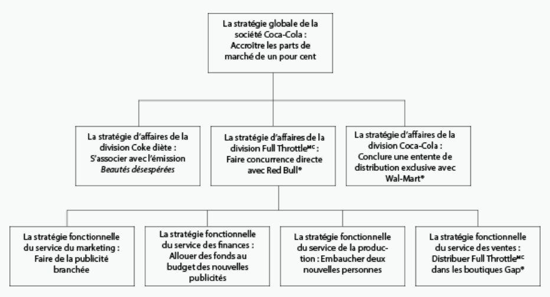

# Les plans à court terme

Ces plans sont de courtes durées, c’est-à-dire, sur un délai d’au plus, un an.

Très souvent, ils sont conçus et mises-en-place par les gestionnaires intermédiaires. On y trouve :

- les plans opérationnels
- les calendriers
- les budgets

## Les plans opérationnels

<Info>Les *plans opérationnels* présentent les objectifs de divers services au sein de l’organisation.</Info>

Ex : les plans de marketing, de production, de ressources humaines, financiers.

## Les calendriers

Utilisé pour des activités qui doivent se faire sur des dates précises.

Ex : Les horaires des employés, les dates de livraison, les dates d’échéances (deadlines), etc.

## Les budgets

Il présente une prévision des recettes (la revenue), des dépenses et des profits potentiels de divers services au sein de l’entreprise.

Les divers secteurs vont présenter leurs demandes budgétaires, tout en justifiant comment ses dépenses sont nécessaires pour maintenir ou augmenter les revenues de la compagnie. Ces nombres sont utilisés pour mesurer sa réussite ou son échec. (Si les dépenses sont plus élevées que prévu, et les revenues sont plus bases, il a un problème qui doit être réglé.)

# Les plans à long terme

<Info>Un *plan à long terme* est un plan qui sera réalisé sur plus d’un an</Info>

Ex : les plans stratégiques, les plans permanents (tel queles politiques et les procédures)

## Les plans stratégiques

Un *plan stratégique* envisage ce à quoi ressemblera l’entreprise plus tard et comment elle devrait se préparer au changement. Ce type de plan s’attarde toujours à l’activité principale d’une entreprise et essaient de gérer les défis auxquels elle pourrait faire face.

## Les plans permanents

Un *plan permanent* est le contrain d’un plan à usage unique. Ils seront utilisés maintes et maintes fois et deviennent des politiques et des procédures d’entreprise et font souvent partie du manuel du personnel.

# La stratégie opérationnelle

Une *stratégie* est une série de plans intégrés qui comprend toutes les ressources et toutes les tâches requises pour atteindre un objectif précis.

## L'importance de la planification

Certaines organisations voient un “trou” dans le marché et cherchent à le remplir sans trop élaborer un plan. Par exemple, les joueurs MP3. La plupart permettaient de jouer de la musique que tu copiais de ton CD ou téléchargait de façon illégale d’Internet. Le produit répondait donc à un besoin mais n’avais pas de stratégie pour évoluer ou gagner une plus grande partie du marché. Par contre, Apple, en introduisant l’iPod, 1) saturé le marché avec des annonces publicitaires qui faisait d’Apple une marque connue et aussi une marque de style 2) a donné aux consommateurs une façon légale d’acheter de la musique, l’iTunes Store. Donc, quand les compagnies de musique rendait le copiage et le partage de musique de plus en plus difficile, Apple avait une stratégie existante pour que son produit continue à être utile.

La planification offre plusieurs avantages, dont l’avantage concurrentiel qui permet à gagner une plus grande partie du marché. Un avantage durable existe quand il offre une position commerciale unique, lorsqu’il réduit les coûts de production ou s’addresse à un marché à créneaux (niche market).

## Les niveaux de la planification stratégique

Plus une entreprise est grande, plus il est **important *et* difficile** de faire une planification stratégique pour accroître les parts du marché et de créer des avantages concurrentiels. Ils doivent planifier leurs stratégies selon ces trois niveaux :

Niveau d’entreprise ⟺ Niveau opérationnel ⟺ Niveau fonctionnel

## Vocabulaire

#### Marché

Tous les produits d’un certain genre qui est en concurrence directe les uns avec les autres pour le même dollar des consommateurs et des consommatrices. Cela peut aussi être un groupe de consommateurs et de consommatrices à qui l’entreprise essaie de vendre son produit ou son service.

#### Avantage concurrentiel

Les caractéristiques ou les avantages d’un produit que les produits concurrents n’offrent pas et que les consommateurs et les consommatrices veulent.

#### Avantage concurrentiel durable

Les caractéristiques ou avantages d’un produit qu’aucune entreprise concurrente ne peut ou ne pourra égaler avant longtemps.

#### Stratégie

Une série de plans intégrés qui comprend toutes les ressources et les tâches requises pour atteindre un objectif précis.

## L'analyse FFPM

Une analyse *FFPM* évalue les **f**orces et les **f**aiblesses des activités internes de l’organisation, ainsique les **p**ossibilités et les **m**enaces provenant de l’environnement externe de l’organisation.

Le principal objectif de l’analyse FFPM est de prendre avantages de ces forces et les possibilités disponibles, tout en réalisant ses faiblesses et étant au courrant des menaces existantes afin de prendre des étapes pour s’y protéger.

Ex : “Utiliser notre avantage sur les prix pour augmenter les ventes nationales, développer des poitns de distribution nationnaux et internationaux et faire une mise en marché plus dynamique de nos marques plus saines.”

Voici un article qui résume bien le FFPM

<LinkCard title="Analyse FFPM (force, faiblesses, possibilités et menaces) | Gestion Orientée vers l'Impact" url="http://www.gestionorienteeverslimpact.org/tool/analyse-ffpm-force-faiblesses-possibilit%25C3%25A9s-et-menaces" />

Voici un exemple de l’analyse FFPM de l’entreprise Canadian Tire.

**Forces**

Canadian Tire a une excellente réputation en rénovation domiciliaire et en entretien de véhicule sur le marché du bricolage.

**Faiblesses**

Certaines personnes pensent que l’entreprise est vieille et un peu usée. Le système de franchise est lourd et lent à changer.

**Possibilités**

Canadian Tire pourrait croître dans le marché de la rénovation domiciliaire.

**Menaces**

Les principaux concurrents du marché de la rénovation domiciliaire sont Lowe’s, Rona et Home Depot.

## La culture organisationnelle

La culture organisationnelle d’une organisation, ce sont les croyances communes à propos de l’organisation, partagées entre tous les membres du personnel, et les valeurs communes que les personnes partagent à l’intérieur de l’entreprise. Ces croyances et ces valeurs jouent un rôle dans la planification stratégique, en ce sens qu’elles régissent la nature et le mode opérationnel de I’entreprise.

La vision et l’énoncé de mission inspire la culture organisationnelle d’une organisation.

Par exemples, certaines organisations inclus dans leur vision et leur énoncé de mission l’importance de protéger l’environnement. D’autres inclus leur vision d’expansion rapide de l’entreprise à tout prix.

La **culture fondamentale** d’une organisation est *ce qu’elle est*. Elle réponde à la question : "Que faisons-nous avec cette entreprise ?”

Ex : Disney souhaite faire vivre à ses invitées une expérience de divertissement mémorable. Coc-Cola souhaite que ses produits soient offerts partout et à tout moment, chaque fois que les gens en veulent.

La **culture observable** est la matière dont la culture se traduit dans l’entreprise, de sorte que les autres peuvent la voir en action.

Ex : Le siège social de Disney met en évidence des photos de Walt Disney et de ses personnages de dessins animés. Disney appelle ses clientes et ses cleints des “invités”, et les personnes qui travaille à Disney World, “la distribution” (cast members).

## La culture organisationnelle et la planification stratégique de Telus

## Stratégie globale

« Notre intention stratégique est de donner libre cours à la puissance d’Internet pour offrir les meilleures solutions aux Canadiennes et aux Canadiens, à la maison, au travail et en déplacement. »

## Les quatres valeurs fondamentales

1. Nous accueillons le changement et nous créons les occasions.
2. Nous sommes passionnés de croissance.
3. Nous croyons à l’esprit d’équipe.
4. Nous avons le courage d’innover.

## Le lien entre les valeurs fondamentales et sa culture observable

Les boutiques sont invitantes. Elle met tout en oeuvre pour offrir la meilleure technologie. Elle a foi en son personnel et le travail d’équipe.

## Les influences des valeurs fondamentales sur sa planification stratégique

La planification stratégique de l’entreprise sera probablement une stratégie de croissance et l’innovation. L’entreprise investira dans son personnel pour réaliser sa croissance.

# Travail

Vous aurez à concevoir une entreprise. Tu peux produire, vendre, ou servir tout ce que tu veux.

## Étape 1 : Description de l’entreprise

Rédige un résumé d’affaires qui décrit ton entreprise (invente n’importe quel entreprise que tu veux, soyez créatifs et créatives). Précise le type d’activités que tu exerces, ce qu’offres au public, la grandeur de la compagnie, où est son siège social, etc.

  - [ ] Je trouve une idée pour une entreprise et a décrit son produit ou service.
  - [ ] Je fais une description qui inclus le type d’entreprise, sa taille, le lieu de son siège social, etc.

## Étape 2 : Analyse FFPM

Fais une analyse FFPM complète de ton entreprise. Tiens compte des forces et des faiblesses internes et des possibilités et des menaces externes.

  - [ ] Je dresse la liste des forces et des faiblesses de mon entreprise (un minimum de quatre pour chacune)
  - [ ] Je dresse la liste des possibilités et des menaces pour mon entreprise (un minimum de quatre pour chacune)

## Étape 3 : Stratégie

Décris une stratégie qui sera poursuivie par ton entreprise et comment tu la poursuivras. Sois précis au niveau de ce que tu feras.

**Remarque :** Assure-toi que ta stratégie ait un certain lien avec un élément de ton analyse FFPM.

  - [ ] Je présente la stratégie avec un bon montant de détails.
  - [ ] Je fais preuve de créativité et d’habiletés en résolution de problèmes dans la description de la stratégie.

## Étape 4: Culture fondamentale

En une phrase, décris la culture fondamentale de ton entreprise. Ensuite, décris trois éléments culturels observables de ton milieu de travail et explique ce qu’ils disent de ta culture.

  - [ ] Je décris la culture fondamentale de mon entreprise en une phrase.
  - [ ] La phrase explique sur quoi se concentrera l’entreprise.
  - [ ] Je décris un minimum de trois éléments observables en milieu de travail qui démontrent ce que c’est que de travailler à cet endroit.
  - [ ] J’explique ce que ces trois éléments signifient pour la culture au travail.
    

- [ ] Je communique clairement, sans fautes d’orthographe ou de grammaire.
- [ ] Le rapport est présenté dans un format professionnel. (Peut être Google Docs, Google Slides mais doit être bien organisé avec des idées complètes)

