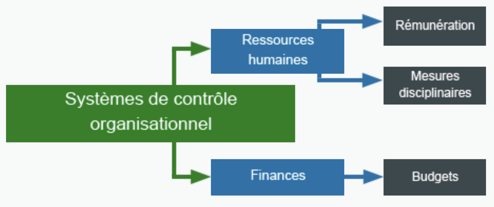

Lorsque nous élaborons un plan, le **contrôle** signifie la façon de mesurer les résultats et assurer l’atteinte des objectifs.

# Le processus de contrôle

Voici les trois étapes du processus de contrôle :

- Établir des objectifs mesurables
    - *Énonce ton objectif*
- Évaluer l’avancement (Évaluer régulièrement l’avancement vers l’atteinte de ces objectifs)
    - *Comment et quand y arriveras-tu ?*
- Ajuster le rendement (Ajuster le rendement pour atteindre les objectifs au besoin.)
    - *Que dois-tu faire si tu n’es pas sur la bonne voie ? Si tu es sur la bonne voie, que dois-tu continuer de faire ?*

Prenons l’exemple d’appliquer au collège.

Si ton objectif est simplement de remettre la demande par le 31 mai, qui est la date de remise, il n’y a aucune évaluation de l’avancement et s’il y a un problème, il n’y a pas de temps pour ajuster.

On devrait donc élaborer un plan qui nous permet de mesurer et ajuster en conséquent.

- Le 10 mai, assurer qu’on a toute l’information nécessaire en vérifiant mes documents à la maison. Si je ne les trouve pas par le 10, je dois communiquer avec l’orienteur.
- Le 17 mai, avoir le formulaire de rempli en utilisant l’information recueillie. S’il n’est pas rempli, demander l’aide d’un parent ou ami pour le remplir.
- Le 18 mai, demander à mes parents ou un ami de le vérifier
- Le 20 mai, le remettre à la poste (ou électroniquement). S’il n’est pas remis, avoir un parent ou un ami m’appuyer avec l’étape qui me donne de la difficulté.

## Établir des objectifs mesurables

Les gestionnaires déterminent les objectifs de leurs plans organisationnels en fonction des critères suivants :

  - Le rendement antérieur
  - Des comparaisons normalisées
  - La méthode scientifique

### Le rendement antérieur

  Revoir les chiffres du budget précédent, consulter les réalisations des précédentes campagnes, étudier le taux d’échec historique, …

### Des comparaisons normalisées

  Les réponses à des questions comme “Qu’est-ce que réalisent les autres membres du personnel?” et “Quel est le rendement des autres écoles?” offrent une bonne base pour l’établissement des objectis quand on les compare aux normes d’autres organisations.
  
  Un point d’information veut rien dire sans lui donner un contexte. Il est important d’avoir des points de comparaisons pour mieux évaluer le point d’information.
  
  Par exemple, Paul a complété une course en 5 minutes et 30 secondes. Ça nous dit vraiment rien sans avoir d’autres informations tel que, combien de temps est-ce que les autres compétiteurs ont pris pour terminer la course? Quel était le temps moyen? Dans quels conditions est-ce qu’ils ont couru? (Pluie? Terrain plat ou montagneuse? Distance? etc.)

### La méthode scientifique

  Plusieurs organisations ont établi les normes optimales pour l’atteinte d’un objectif. Par exemple, nous savons que, pour appliquer à un tel programme au collège ou à l’université, tu devrais avoir un certain pourcentage minimale dans un cours. C’est la norme optimale pour un élève dans ce cours qui veut appliquer à ce programme.

  Les **résultats de rendement** comprennent des indicateurs mesurables, comme des chiffres de ventes, les stocks, les part de marché et le profit.

  Le mécanisme qui sert à mesurer ces résultats constitue généralement d’une série de **points de contrôle** qui déterminent à quel point l'entreprise est près d’atteindre son objectif.

  Les **données d’entrée du rendement** comprennent le nombre d’heures passés à une tâche, l'efficacité du travial d'une employée et le degré d'efficacité de l'employée à sa tâche. À noter que ces données sont souvent difficiles à analyser. Si on tente d'acheter une machine IRM dans 12 mois, qui coûte 2M$ et, après 6 mois, nous avons 1M$, sommes nous sur la bonne piste ou signe d'un problème?

  La planification établit les contrôles; l’organisation détermine comment les contrôles sont mis en oeuvre, et le leadership évalue les données d’entrée et les résultats du travail. Le ou la gestionnaire des ressources humaines ou un autre responsable crée des outils d’évaluation pour mesurer l’efficience, la ponctualité, le temps passé à une tache et d’autres indicateurs de rendement.

## Évaluer l’avancement

La raison principale pour un système de contrôle c’est de remarquer et corriger les problèmes avant qu’ils ne deviennent trop grandes.

<Card>
Les points de contrôle sont les moments dans le processus où les gestionnaires peuvent déterminer les variables de l’équation du contrôle :

***Mesure à prendre = Où on devrait être - Où nous sommes***
</Card>

## Ajuster le rendement

La gestion devrait également intégrer des points de contrôle durant l’exécution du plan pour permettre de modifier le plan, au besoin.

Avec l’exemple du prélèvement de 500 000$ en 12 mois pour l’achat d’une machine IRM. Si les gestionnaires voient qu’au mois d’avril, ils ont prélevé 50 000$ moins que prévu, ils ont emplement de temps pour faire les ajustements nécessaires pour tenter de régler le problème tel que former un nouveau comité d’événements pour aider à prélever plus d’argent. C’est toutes des choses qui ont été décidé à l’avance et font partie du plan.

---

# Les contrôles internes et externes

## Les contrôles internes

  Ce sont les contrôles que les gens utilisent pour se gérer eux-mêmes. Cela comprend: l’autodiscipline, l’établissement d’objectifs personnels, l’autoévaluation.

## Les contrôles externes

  Ce sont les règles, les règlements et les procéddures dont se servent les gestionnaires et les superviseuses et les superviseurs pour contrôler le rendement de leur personnel. Si le travailleur ne suit pas ceux-ci, les gestionnaires peuvent lui imposer des mesures disciplinaires tel que des réprimendes verbales ou écrites. C’est ce qu’on appelle les **mesures disciplinaires progressives.**

## Exemple #1

  **Objectif**: Se réveiller le matin pour l’école

  **Points de contrôles**: La nuit quand c’est le temps de se préparer à se coucher. Le matin au réveille

  **Observation prise**: L’heure du couché, l’heure du réveille, le montant de fois qu’on fait “Snooze”

  **Contrôle interne**:

   - Se dire à 22h00, fermer la télé(vision/phone) et se dire qu’on doit se mettre au lit. (Autogestion)
   - Mettre un alarme le matin pour se réveiller. Aller au lit à un heure pré-établi (Autogestion)
   - Choisir de sortir du lit le matin pour aller à l’école (Autodiscipline)
   - Si je fait “snooze” plus que 3 fois (autoévaluation), je vais déplacer l’alarme à l’autre bout de la chambre (autogestion/autodiscipline).

  **Contrôle externe:**

   - Nos parents qui nous disent que c’est l’heure d’aller au lit
   - Nos parents qui viennent nous reveiller

## Exemple #2

  **Objectif**: Compléter la course en 18:00.

  **Points de contrôles**:
- Pendant la course (mesurer son temps à chaque 500m)
- Après la course (voir si on a amélioré notre temps)

  **Observation prise:**
- Temps pour courrir chaque 500m
- Temps pour compléter la course

  **Contrôle interne**:
- Se pousser pour atteindre le temps voulu pour cette section de 500m. (Autodiscipline)
- Vérifier le temps nécessaire pour courrir chaque 500m. (Autoévaluation)

  **Contrôle externe**:
- L’entraîneur évalue notre niveau de fatigue et nous suggère de pousser plus ou moins fort.
- L’entraîneur mesure notre pace et nous dit si on est en ligne pour atteindre notre objectif.

---

# Les systèmes de contrôle organisationnel

Dans une entreprise, on retrouve des systèmes de contrôle organisationels tel que les ressources humaines et les finances.

## Rénumération

La rénumération est un exemple d’un moyen de contrôle du comportement positif. La paye devrait être associée au rendement à chaque échelon de l’organisation, afin de veiller à ce que les membres du personnel très motivés et performants soient récompensés et que ceux qui sont moins motivés et qui offrent un rendement inférieur ne soient pas récompensés.

Le gestionnaire peut aussi utiliser les avantages comme les congés, un véhicule, une carte de crédit d’entreprise, etc. comme rénumération.

## Les mesures disciplinaires

Les gestionnaires peuvent contrôler les infractions mineures comme le travail bâclé (qui n’est pas soignée), l’absence d’effort et les retards répétés en documentant chaque infraction et en augmentant la sévérité des mesures disciplinaires au fur et à mesure que la liste s’allonge. C’est ce qu’on appelle les mesures disciplinaires progressives.

Une autre possibilité pour contrôler les comportements négatifs est une trousse de départ négociée (*buy out package* ou *exit package*), qui peut comprendre un règlement financier raisonnable, une poursuite à court terme des avantages sociaux et une lettre de recommandation. Ce procédé prend moisn de temps que les mesures dsciplinaires progressives.

## Budgets

C’est une prévision écrite des entrées et des sorties d’argent. Il contient l’historique financier, budgété et réel, ainsi que des prévisions à jour pour des moments précis du futur.

Si le moment réel ne correspond pas à la prévision budgétaire, les gestionnaires doivent agir pour ajuster le rendement avant que la situation ne se dégrade.

---

# Les types de contrôles

Il y trois types : Le contrôles en aval (futur), les contrôles concurrents (présent), les contrôles rétroactifs (en conséquence du passé).

## Les contrôles en aval (Avant)

- Planification
- Déterminer les besoins en dotation et embaucher du personnel
- Décider des structures organisationnelles et organiser les équipes au besoin
- Péparer les lieux de travail
- Prévoir les niveaux de stocks et de fournitures requises et passer des commandes, au besoin
- Rédiger un plan de marketing et créer de la publicité de et promotions
- Former le personnel

## Les contrôles concurrents (Pendant)

Aussi appelés les *contrôles de direction*, parce qu’ils orientent l’organisation dans la bonne direction.

Ils permettent aux gestionnaires de surveiller le rendement *au fur et à mesure de son exécution* et de corriger tous les problèmes éventuels jusqu’à son achèvement.

Ex:

- les budgets
- les systèmes de contrôle de qualité
- les méthodes de contrôle des stocks
- les horaires du personnel

Si l’on déctecte des problèmes dans l’un de ces domaines, les gestionnaires peuvent apporter des chamgements pour éviter que le problème dégénère.

## Les contrôles de rétroaction (Après)

C’est une évaluation de l’exercise (l’exécution de l’objectif) une fois terminée pour voir ce qui s’est bien pasé et ce qui a moins bien été. Elle offre de l’information précieuse pour la future planification.

L’information tirée de la rétroaction fera souvent partie des prochains contrôles en aval.

# Travail

Imagine que tu dois faire un projet de recherche en English.

Donne un exemple d’un contrôle en aval, d’un contrôle concurrent et d’un contrôle de rétroaction.
Précise qui chaque côntrole est interne ou externe.

