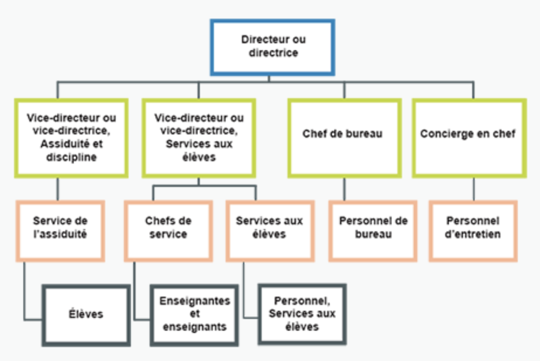
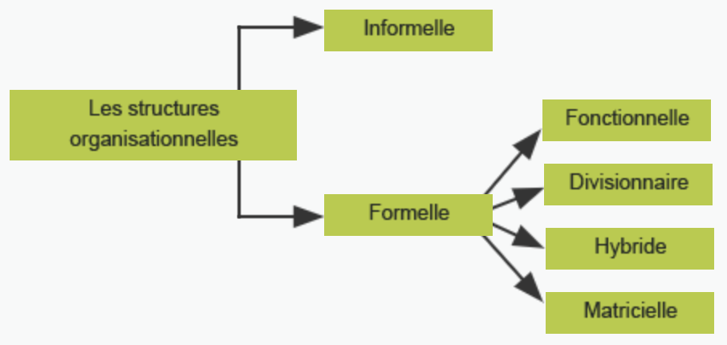
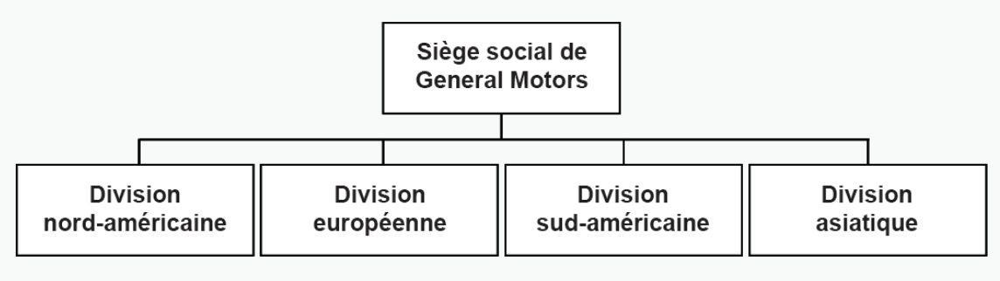
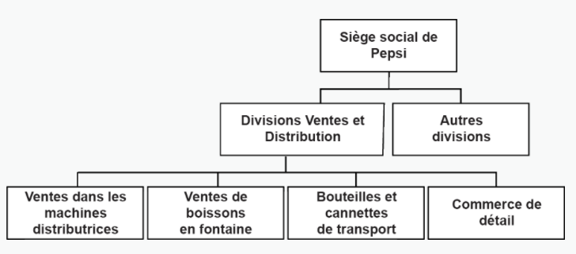
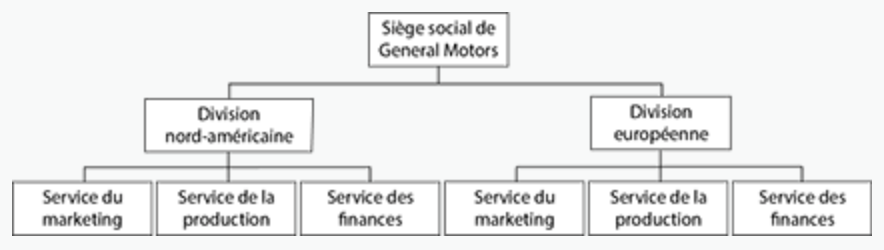
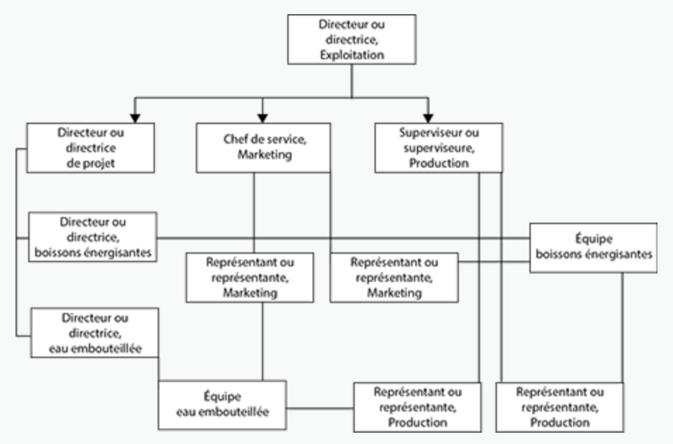

Le diagramme ci-dessus repésente une structure organisationnelle hiérarchique. Les liens sur l’organigramme indiquent :

- qui fait quoi
- qui doit parler à qui
- qui a de l’autorité sur qui
- qui est lié à qui

Cette hiérarchie est un exemple d’une structure formelle, la structure de l’organisation qui est reconnue formellement par la création de l’organigramme et des titres des personnes.

Dans une structure formelle, on peut séparer les membres du personnel de 4 différentes façons :

- D’après leur fonction (La structure fonction)
- D’après l’environnement qu’ils travaillent (La structure divisionnaire)
- Un mélange des deux (La structure hybride)
- Des équipes dynamiques qui se forment et se reforment sous un chef d’équipe pour chaque nouvel objectif. (La structure matricielle)

# La structure fonctionnelle

Celle-ci organise les membres d’après leurs fonctions et leurs expertises.

Ex : Département de finances, département de marketing, département de service à la clientèle.

Ex : Département de sciences, secrétaria, consiergerie

# La structure divisionnaire

Celle-ci organique le personnel en groupes de travail en onction de raisons autres que les fonctions courante

Il y a cinq catégories divisionnaires typiques :

a. par produit

b. géographique

c. par clientèle

d. hybride

e. matricielle

## Les structures par produit

Forment des groupes distinctes pourtout le personnel qui traaille sur un même produit. Chaque division est supervisée par un **gestionnaire de marque**. Celui-ci est responsable de toutes les activités de marketing de soutien à une marque en particuler : la publicité, la distribution, l’emballage, les ventes, la recherche, l’expédition et le développement des produits.

Ex : Rogers Communications est structurée en quatre grands secteurs d’activités : la radiodiffision, la publication, les télécommunications et la distribution.

## Les structures géographiques

Forment des groupes distinctes d’après les régions du monde qu’il déservi.

## Les structures selon la clientèle

Les entreprises qui exercent leurs activités sur plusieurs marchés de clientèles différents (segments de marché) créent souvent une structure organisationnelel qui traduit les différences entre ces segments de marché.

Ex : Chez Pepsi-Cola, ils divisient leurs services selon la clientèle, sois les restaurants et cinémas qui vendent la boisson gazeuse en fontaine, la division pour les machines distributrices, la division pour la distribution en magasin pour la vente au public.

# Les structures hybrides

Une structure hybride combine soit une structure fonctionnelle et une structure divisionnaire, sois plus d’un type de structure divisionnaires.

# Les structures matricielles

La structure matricielle est une approche très intéressante qui combine les structures fonctionnelles et divisionnaires. Ici, il y a différents projets ou tâches qui a un ou une gestionnaire de tâche qui crée une équipe fonctionnelle. C’est-à-dire, le gestionnaire va aller recruter des membres du corps personnel de l’entreprise et les assigner une tâche donnée. Une fois la tâche complétée, la personne pourrai se faire assigner des tâches d’une différente division de l’entreprise.

Par exemple, quelqu’un du département de marketing d’Apple pourrait se faire approcher pour produire une annonce publicitaire pour l’iPhone (une division de la compagnie), et, par la suite, se faire approcher pour produire une annone pour le MacBook (une autre division de la compagnie).

Donc, les divisions se partagent les ressources communes au lieu d’avoir un département de marketing pour chaque division. De plus, comme plusieurs groupes fonctionnels (ex : design, marketing, software, etc.) travaillent ensemble dans une même équipe, il peut avoir une échange d’idées et une coopération entre les grouopes fonctionnelles qui n’est pas possible dans une structure divisionnaire.

## La décentralisation

La décentralisation est une variation de la structure matricielle.

Les avances technologiques ont offert aux entreprises une occasion de décentralisation unique. Dans le modéle organisationnel classique, le contrôle était souvent centralisé dans le bureau de la haute direction, avec des édits et des directives qui traversaient les nombreux échelons de gestion, jusqu’à se rendre aux personnes qui devaient agir en fonction de ces ordres. Dans les modéles non classiques, la gestion centrale peut formuler un plan stratégique et ensuite décentraliser l’exécution des taches en confiant le pouvoir d’agir et la responsabilité des résultats aux gestionnaires. Dans une telle organisation décentralisée, les rôles des gestionnaires sont ceux de batisseurs d’équipe et de chefs de projet. La gestionnaire choisit des employés créatifs et autodirigés pour former des groupes de travail, leur donne les pouvoirs et l’autorités nécessaires et travaille avec l’équipe pour formuler et exécuter des plans fonctionnels.

Les entreprises décentralisées sont plus prés de leur clientéle. Un fabricant de vétements de Vancouver pourra réussir mieux en Allemagne s’il a une succursale de distribution dans ce pays, avec du personnel allemand, qui gére la distribution de vétements comme une entreprise allemande.

La décentralisation est essentielle dans une économie mondiale. Elle offre la fluidité culturelle dont les entreprises ont besoin pour réussir sur les marchés étrangers. L’évolution de la technologie informatique permet à l’entreprise centrale de rester en contact permanent avec les sous-unités, de sorte que les chiffres des stocks, les rapports sur les styles, les données du marché et les renseignements d’expédition sont accessibles au besoin.

# Travail

Complètez le Google Slides dans Classroom.

