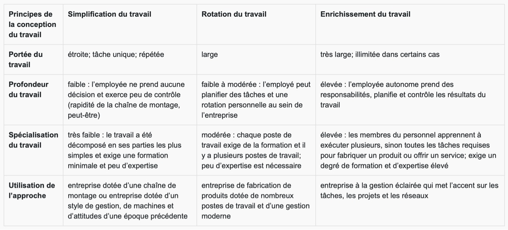

# La raison du travail

Le travail, c’est plus que ce que nous faisons pour l’argent. Le travail définit une portion importante de notre vie de tous les jours ; c’est là où on trouve nos amies et nos collègues ; c’est l’endroit où : nous mettons en pratique les compétences que nous avons développées, nos talents et les choses que nous avons apprises. Demande à des gens de te parler d’eux et, souvent, ils répondront par leur titre professionnel (« Je suis comptable » ou « Je suis conceptrice », par exemple). Le travail a généralement une grande signification pour la plupart des gens.

# Le travail

> Le **travail** est une activité physique ou mentale qui est effectuée pour fabriquer ou accomplir quelque chose autre que le plaisir personnel ou la détente.

Si tu reçois une paie pour ton travail, ça devient ton emploi, ta carrière ou ta profession. Tu fais beaucoup de travail sans recevoir de paie, cependant : les travaux ménagers, les travaux dans la cour, les travaux d’entretien, les devoirs, par exemple. Notre définition du travail le distingue du plaisir ou de la détente. Lire un roman ou regarder la télévision sont des activités mentales que tu effectues pour le plaisir ou la détente ; par conséquent, ce n’est pas du travail.

Nous avons tendance à utiliser les mots plaisir ou amusement en opposition au mot travail, comme dans la phrase « Le jardinage n’est pas un travail pour moi, c’est juste plaisant ». De nombreuses personnes aiment leur travail et en retirent beaucoup de plaisir. Il existe beaucoup de lieux de travail agréables.

# La raison du travail

De nombreuses entreprises ont appris qu’il est beaucoup plus facile de conserver des personnes qui aiment ce qu’elles font et qui ont du plaisir au travail. Prends un instant pour lire l’article « [40 experts partagent leurs recettes pour rendre les milléniaux heureux au travail](https://academos.qc.ca/blogue-corporatif/40-experts-partagent-leurs-recettes-pour-rendre-les-milleniaux-heureux-au-travail/) », qui traite de ce que cherchent les membres de la génération du millénaire au travail.

# Le contrat psychologique

> Un **contrat psychologique** est la croyance (les attentes non écrites) des deux parties selon laquelle elles donnent (par des obligations) et reçoivent (par des droits et des avantages) une valeur égale à l’autre.

Dans un contrat psychologique entre un employeur et une employée intervient un échange de résultat du travail (de l’employée) contre une rémunération acceptable (de l’employeur). Par exemple, un membre du personnel en cuisine d’un restaurant lave la vaisselle et aide à la préparation des repas. En échange de ce travail, la propriétaire du restaurant paie l’employé à un salaire horaire, qui est compétitif par rapport aux autres restaurants, et lui offre un ensemble d’avantages sociaux.

Le principe majeur d’un contrat psychologique est l’équité. Des problèmes peuvent survenir lorsqu’une partie croit que le contrat psychologique n’est pas équitable. Par exemple, lorsqu’un employé gagne plus ou a plus de congés qu’une autre, ou lorsque le patron est gentil avec une personne et affiche de l’inimitié envers une autre. Toutes ces choses peuvent détruire le contrat psychologique et faire en sorte que l’employée quitte son emploi ou, a tout le moins, qu’elle soit malheureuse et en colère contre la situation. Les membres du personnel dans une telle position peuvent agir de manière à nuire a l’entreprise, comme se plaindre a des étrangers à propos de l’endroit ou donner un mauvais service a la clientèle. À l’inverse, si un employé est heureux et satisfait de ses conditions de travail et de sa paie, en règle générale il mettra tout en œuvre pour offrir un bon rendement et un bon service a la clientèle. Il est donc dans l’intérêt supérieur des gestionnaires de veiller à ce que les membres du personnel aient un contrat psychologique positif.

## La qualité de la vie professionnelle

La manière dont les gens se sentent au travail a une incidence sur la manière dont ils traitent la clientèle, sur leur relation avec leurs collègues et sur leur manière de travailler (leur productivité). Des personnes malheureuses au travail ne sont pas aussi productives ou efficientes que des personnes heureuses. Elles prennent davantage de congés de maladie et leur attitude peut nuire aux ventes. En grande partie, il incombe aux gestionnaires de veiller a ce que le personnel vive une expérience positive au travail. Les gestionnaires peuvent utiliser plusieurs moyens pour créer une expérience positive : des couleurs et une décoration réfléchie dans la conception générale du lieu de travail ; des pièces comme une salle de repas, un salon ou des installations sportives ; des programmes sociaux comme des barbecues ou des repas-partage ; des programmes d’aide aux employées et aux employés pour aider le personnel à gérer des problèmes financiers, émotionnels ou de santé.

Avant toute autre chose, la cause la plus courante et la plus importante du malheur du personnel est un ou une gestionnaire difficile : le tyran insensible, sans empathie, exigeant, mal formé, sans sens de l’humour, qui s’approprie les idées des autres, qui se sent manifestement supérieur a l’ensemble de son personnel subordonné et qui a de mauvaises manières. Les employées et les employés qui doivent faire face à une telle personne chaque jour finissent par détester leur travail et sont constamment a la recherche de moyens de le quitter ou de nuire a la personne qui rend leur vie misérable. Le ou la chef de ce gestionnaire est aussi responsable — de ne pas savoir à quel point cette personne cause de graves dommages a l’entreprise et a la vie personnelle des nombreuses personnes qui y travaillent. Lorsqu’on se retrouve avec une mauvaise gestion, des conditions de travail médiocres et une économie difficile, les travailleurs et les travailleuses peuvent devenir très malheureux. Voici quelques ressources utiles sur la manière de traiter avec un ou une chef difficile. Lis un des articles ou un article de ton choix au sujet d’un gestionnaire ou d’un patron difficile. « [Un gestionnaire difficile, comment y parvenir](https://www.finance-investissement.com/fi-releve/strategie-daffaires/un-gestionnaire-difficile-comment-y-parvenir/) » et « [10 excellents conseils pour gérer un patron difficile](https://www.insightsforprofessionals.com/fr-fr/management/leadership/tips-for-dealing-with-a-difficult-boss) ».

## La satisfaction au travail

Il existe une très grande corrélation entre le rendement au travail et la satisfaction au travail et l’un dépend de l’autre. Cependant, il n’y a pas de méthode unique pour apporter la satisfaction au travail a chaque membre du personnel. Même un salaire élevé, qui semble la motivation et la solution les plus évidentes, ne fait pas nécessairement en sorte qu’un emploi insatisfaisant deviendra satisfaisant. Une combinaison de facteurs contribue à la satisfaction au travail :

### Les relations avec le superviseur ou la superviseuse et les collègues

De mauvaises relations de travail peuvent rapidement entraîner l’insatisfaction au travail.

Une bonne gestionnaire peut atténuer les confrontations entre employées et employés en leur offrant des moyens de se libérer du stress et des tensions.

La construction soigneuse des équipes et un leadership intelligent éviteront que la plupart des questions relationnelles se transforment en problèmes pour les personnes qu’ils concernent et l’entreprise.

### Le milieu de travail

Des programmes d’horaire flexible, dans lesquels une employée peut établir son propre horaire de travail, sont une mesure positive de la création d’un milieu de travail qui soutient le personnel.

Avec les horaires flexibles, le soutien commence dans les transports du matin et du soir au travail, que l’employée peut choisir elle-même.

Un milieu de travail positif offre plus de confort au personnel : des meubles, de l’équipement, des fournitures, un coin repas, un centre de détente et même un centre sportif offrent des niveaux de confort qui augmentent la satisfaction au travail.

### La valeur et la complexité de la tâche

Les membres du personnel devraient considérer que leur travail est important pour l’entreprise. Une des tâches du ou de la gestionnaire est de souligner l’importance de ce travail le plus souvent possible.

Lorsqu’un travailleur ou une travailleuse voit la vue d’ensemble et comprend comment ses efforts contribuent à la réussite de l’ensemble de l’entreprise, sa satisfaction au travail est plus grande.

Les tâches ne devraient pas être trop complexes pour les personnes qui les exécutent, ni trop simples. La complexité engendre la frustration, mais la simplicité engendre l’ennui. Les deux réduisent la satisfaction au travail.

Un ou une gestionnaire efficace fait correspondre les tâches de l’employé à ses aptitudes. L’objectif est de mettre le personnel au défi, pas de le décourager.

### Les possibilités d’avancement

Tu as sans doute déjà entendu l’expression « emploi sans issue ». Si un employé désire avancer dans une organisation pour prendre plus de responsabilités, augmenter son estime personnelle et obtenir un meilleur salaire, l’organisation devrait lui en offrir la possibilité. L’employé devrait être appuyé dans la transition vers un poste plus exigeant. Souvent, plus le défi professionnel est grand, plus la satisfaction au travail est grande.

# Les différentes approches de la conception du travail

Les entreprises peuvent améliorer la satisfaction au travail en choisissant la conception du travail qui convient a chaque membre du personnel. Chaque conception du travail appelle ces trois principes :

1. La portée du travail et le nombre de taches précises attribuées à une personne.

   L’employé A, qui travaille dans un entrepôt, remplit des commandes en prenant une carte de commande, en conduisant un chariot jusqu’au bon casier de l’entrepôt, en y mettant les articles de la commande et en ramenant le chariot à l’endroit prévu. Cet employé a une seule tâche à accomplir chaque jour ; son travail a donc une portée très étroite. L’employée B, qui travaille dans une animalerie, remplit les tablettes, fait le nettoyage, prend les rendez-vous de toilettage et répond aux demandes de la clientèle. Cette employée a plusieurs tâches à accomplir chaque jour ; son travail a donc une portée beaucoup plus large.

2. La profondeur du travail est le degré d’influence qu’un membre du personnel exerce au sein d’une tache précise, notamment la planification, le contrôle, le leadership et l’organisation.

   L’employé A et l’employée B ci-dessus ont une profondeur de travail limitée, étant donné qu’ils ont une influence limitée dans leurs tâches. Cependant, l’employée C, la gestionnaire de l’animalerie, embauche du personnel, commande des fournitures et des accessoires pour animaux, aménage le magasin et établit les horaires de travail. Le travail de la gestionnaire a beaucoup de profondeur.

3. La spécialisation du travail est le degré de formation et d’expertise nécessaire pour faire le travail.

   Le travail A exige une formation minimale et peu d’expertise. Le travail B exige beaucoup de formation et peu d’expérience. Le travail C exige beaucoup de formation et beaucoup d’expertise.

Les conceptions du travail suivantes combinent divers degrés de portée, de profondeur et de spécialisation.

## La simplification

La simplification signifie que les tâches du travail sont simples, répétitives et faciles à apprendre. La conception du travail classique qui consiste à créer une division de main-d’œuvre intégrant les êtres humains à la machine ou à la chaîne de montage est efficiente et productive, pourvu que les employées et les employés exécutent les tâches qui leur ont été attribuées. Cependant, la simplification du travail entraîne souvent une faible satisfaction au travail, ce qui donne lieu à un taux d’absentéisme et à un roulement de personnel élevés.

## La rotation

La rotation présume que l’employé ou l’employée exécute un éventail de tâches dont la complexité varie, ce qui, d’une part, contribue à un sentiment d’accomplissement et, d’autre part, permet à l’employée ou l’employée de comprendre l’ensemble des activités de l’organisation dont elle fait partie.

## L'enrichissement

L’enrichissement du travail offre des occasions de défi et mobilise le travailleur ou la travailleuse. Les membres du personnel ont le sentiment d’accomplir quelque chose d’important et d’apporter une contribution à l’entreprise. Ils et elles peuvent prendre des décisions et assumer la responsabilité de leur travail. En d’autres mots, l’enrichissement du travail habilite les membres du personnel, ce qui augmente considérablement la satisfaction au travail — pourvu que l’employée ou l’employé veuille bien être autonome.

Voici un résumé des différentes conceptions du travail.

L’étude de cas suivante illustre les trois principes généraux : la simplification, la rotation et l’enrichissement du travail.

### La simplification

C’était la première journée de travail d’Emily à la boulangerie Bread and Butter. Elle a mis un uniforme propre, a passé un filet sur ses cheveux et a commencé son travail à la chaîne d’assemblage des brioches. Elle a passé huit heures (avec une pause au dîner et deux pauses de 15 minutes) debout devant un transporteur à courroie blanc qui se déplaçait lentement devant elle et trois collègues. Le transporteur à courroie était plein de brioches. Emily et ses collègues ramassaient les brioches par douzaine, les plaçaient sur une plaque à cuisson et plaçaient ensuite la plaque sur une étagère. Chaque étagère pouvait contenir 24 plaques. Lorsqu’une étagère était pleine, Emily la déplaçait sur le côté et commençait à remplir une autre étagère. Elle présume que l’étagère était transportée dans le four pour la cuisson, mais elle n’en est pas certaine.

Les conversations le long de la chaîne étaient peu fréquentes, étant donné que les brioches passaient assez rapidement et on pouvait en manquer une ou deux si on ne faisait pas attention. Le superviseur de la chaîne le soulignait chaque fois où une brioche s’était « échappée », ce qui était très gênant pour la personne qui l’avait laissée passer. Emily s’est mise à rêver que le transporteur à courroie allait s’arrêter juste un instant pour qu’elle puisse s’asseoir, sans parler de son ennui après une heure de son quart de travail. À la fin de sa journée, ses jambes étaient fatiguées. Emily s’est demandé combien de temps elle allait pouvoir rester là.

### La rotation

C’était la première journée de travail d’Emily à la boulangerie Bread and Butter. Elle a mis un uniforme propre, a passé un filet sur ses cheveux et a commencé son travail à la chaîne d’assemblage des brioches. Après une heure, Emily est passée à la machine d’emballage des pains à hamburger. L’utilisation de cette machine comportait plusieurs étapes et Emily a trouvé difficile de mettre huit pains dans une pile bien formée. La machine déplaçait chaque pile dans un emballage en plastique et le tournait. Emily prenait le sac de la machine, enroulait une attache sur le dessus et plaçait le sac fini dans une grande boîte qui contenait 24 sacs. Une fois la boîte pleine, elle la déposait sur un chariot et, lorsque le chariot était plein, elle en commençait un autre.

Après quelques heures à la machine d’emballage, Emily s’est rendue dans la salle des fours, où elle a placé les plaques de brioches non cuites (dont certaines contenaient les brioches qu’elle avait mises elle-même sur des plateaux) sur une étagère qui se déplaçait lentement vers un énorme four.

À l’aide d’une longue cuillère en bois, Emily retirait toutes les brioches cuites de leur plaque de cuisson, pour les déposer sur un transporteur à courroie qui se rendait vers la salle d’emballage. Emily a aimé ce travail, surtout l’odeur du pain fraîchement sorti du four. Une fois le travail au four terminé, Emily a pu prendre un sac de brioches fraîchement cuites et rentrer à la maison.

La rotation du travail a offert à Emily des tâches plus variées, ce qui a préservé son intérêt et l’a même amusée de temps en temps. Chose sûre, Emily n’a pas détesté ce travail et elle était heureuse de faire partie de l’ensemble de l’organisation ; ça lui a donné un sentiment d’accomplissement et a augmenté sa satisfaction au travail. Si Emily n’était pas trop ambitieuse et désirait simplement un emploi sûr et pas compliqué, elle pourrait se sentir pleinement satisfaite par celui-ci.

### L’enrichissement

C’était la première journée de travail d’Emily à la boulangerie Bread and Butter. Elle a mis un uniforme propre, a passé un filet sur ses cheveux et s’est assise pour sa première réunion sur les produits. Elle s’est jointe à l’équipe des pains déjeuner. Ce matin, l’équipe a discuté de deux plaintes reçues de la clientèle concernant le nombre de raisins dans les pains aux raisins. Les membres de l’équipe ont goûté à plusieurs types de raisins et Emily a pu librement donner son avis.

Après la réunion, Emily a pris part à une équipe de production en petits lots et a appris la recette de base pour la pâte du pain déjeuner. On lui a demandé de fabriquer quelques pains d’expérimentation à l’aide de différentes quantités de raisins, de les cuire, de les goûter et de communiquer ses résultats à la prochaine réunion de l’équipe des produits, deux jours plus tard. C’était aussi une excellente occasion de s’exercer à la recette de pâte. Emily n’a même pas vu qu’il était temps de rentrer : elle a travaillé une demi-heure de plus pour être certaine que son dernier lot de pains était acceptable.

Te souviens-tu de l’Emily du scénario de rotation du travail ? Elle était assez satisfaite et n’aurait peut-être pas été heureuse d’avoir plus de responsabilités.

Pour s’assurer que tu as bien compris quand utiliser ces approches de la conception du travail, effectue l’[activité d’association suivante](https://docs.google.com/forms/d/e/1FAIpQLSdjVCCYAJ7iAGIIcTBqTiKF4tH8Ppa1zxsNhJh1ruWM5h1xZg/viewform?usp=sf_link).

# Les différents milieux et aménagements du travail

Comme le travail et la technologie évoluent et que les attitudes par rapport au travail changent, il est souvent nécessaire de modifier le milieu ou les horaires de travail. Si une entreprise a besoin de l’information d’équipes créatrices et de réseaux interconnectés 24 heures sur 24, 7 jours sur 7, on peut se demander pourquoi conserver des cubicules de bureau et un horaire de travail de 9 à 5. Des espaces de travail créatifs et des horaires flexibles et habilitants seraient beaucoup plus sensés. Les gestionnaires d’aujourd’hui ont plusieurs milieux et aménagements du travail différents à considérer.

## Le partage du travail

Dans le partage du travail, une entreprise divise un travail entre deux personnes - l’une peut venir travailler le matin, tandis que l’autre travaille l’après-midi. Un autre aménagement consiste à donner une journée de congé suivie d’une journée de travail. La force de ce type d’horaire est qu’il permet de conserver des membres du personnel qui autrement seraient mis a pied, alors que deux personnes se Partagent ce qui était autrefois un emploi à temps plein. Il permet aussi aux membres du personnel qui ont une famille de s’associer avec d’autres (qui l’ont ou ne l’ont pas) pour réduire les coûts de la garde des enfants et en faciliter l’organisation. Plusieurs travailleurs et travailleuses ne veulent travailler qu’à temps partiel. Le partage du travail offre des heures de travail à temps partiel avec les avantages sociaux et le statut du travail à temps plein. La principale faiblesse de cet aménagement réside dans les problèmes d’ajustement potentiels entre collègues. Les deux membres du personnel qui Partagent le travail ont besoin de coordonner leurs activités et de veiller à ce que la transition chaque jour (ou chaque deux jours) se fasse le plus en douceur possible.

## Les équipes autogérées

Tu as lu sur les équipes autogérées plus tôt dans ce cours. Les entreprises forment des équipes de travail axées sur des projets ou des taches en particulier. L’équipe fixe son propre horaire et la réussite se mesure en résultats, pas en heures travaillées. Les équipes peuvent travailler tard dans la nuit pour résoudre des problèmes (et elles le font souvent). L’approche en équipe habilite les membres du personnel et accroit la créativité et la motivation. En fait, sa principale faiblesse réside dans le fait qu’une équipe axée sur les résultats peut devenir obsédée à propos d’un projet et y travailler trop fort, risquant l’épuisement professionnel.

## Les horaires de travail

Certaines personnes travaillent mieux le matin et d’autres l’après-midi. Certaines personnes ont des obligations familiales à certaines heures de la journée, tandis que d’autres préfèrent se déplacer en dehors des heures de pointe. Pour plusieurs raisons, tout le monde n’aime pas travailler de neuf à cinq. De nombreuses entreprises offrent différents horaires pour s’adapter aux préférences individuelles de leur personnel et augmenter la satisfaction au travail.

### La semaine de travail comprimée

Les membres du personnel peuvent s’organiser pour faire leur semaine de 40 heures en moins de cinq jours. Par exemple, tu pourrais travailler douze heures pendant trois jours et quatre heures une quatrième journée. Tu pourrais aussi travailler dix heures pendant quatre jours. Dans les deux cas, tu auras une fin de semaine de trois jours. Certaines personnes préfèrent travailler dix heures pendant huit jours pour avoir une semaine complète de congé. Les vacances ou les congés peuvent être une mesure incitative importante, soit pour se joindre à une entreprise, soit pour y rester. Cette mesure incitative est souvent plus puissante que l’argent.

Dans un milieu de fabrication, on constate souvent une augmentation de l’efficience avec les quarts de dix heures. Comme la semaine compte une journée de moins, il y a un démarrage et un arrêt de moins, soit les deux moments les moins productifs de la journée. Une entreprise qui applique les semaines de travail comprimées doit gérer de multiples horaires et un éventail de demandes. Cela devient souvent très complexe et peut augmenter la tâche de travail du service des ressources humaines.

### Les horaires flexibles

Grâce aux horaires flexibles, les membres du personnel peuvent choisir comment organiser leur journée de travail : arriver tôt et quitter tôt ou arriver tard et partir tard. Cela réduit le stress, surtout chez ceux qui ont de jeunes enfants. Les horaires flexibles leur permettent de profiter de matinées plus détendues avec les enfants, ou de le prendre tout de suite après l’école et épargner ainsi sur les frais de garde. Certaines personnes trouvent qu’il est beaucoup plus calme et efficient de venir au travail à 6 h et de quitter le bureau à 15 h. L’inconvénient est que les gestionnaires doivent allonger leur journée pour superviser les membres du personnel qui arrivent tôt ou qui partent tard. Cela peut conduire à une hausse des coûts et à une baisse de la qualité de vie des gestionnaires supérieurs.

## Le travail à distance

Avec le développement d’Internet, de nombreux emplois peuvent être exercés de la maison. Certains membres du personnel travaillent quatre jours à la maison et se rendent au bureau une fois par semaine. D’autres, dans une organisation en réseau, par exemple, ne vont jamais au bureau. Les personnes qui travaillent a distance constatent que travailler à la maison et éviter le transport quotidien est beaucoup moins stressant et coûteux (économies sur les vêtements, les repas, l’essence et l’entretien des véhicules ou les frais du transport en commun). Par contre, elles doivent être capables de gérer la myriade de distractions de la maison, comme les voisins et les proches.

## Le travail contractuel

Par le travail contractuel, une entreprise embauche une personne pour qu’elle travaille à un projet pendant une période donnée. Lorsque le projet est terminé, cette personne doit se trouver un autre contrat. Par cet aménagement, l’entreprise a de la flexibilité dans l’embauche et la personne bénéficie d’un engagement qui lui assure un certain salaire pendant une période précise. De nombreux employés contractuels adorent la liberté qui vient a la fin du contrat. Cependant, l’absence de sécurité d’emploi en rebute d’autres, et ce n’est pas un aménagement idéal pour beaucoup de personnes. L’entreprise aussi perd avec le travail contractuel, puisque les personnes embauchées par contrat ne sont pas du tout engagées dans la culture organisationnelle.

Résumons le contenu de cette leçon pour vérifier que tu as bien compris les différents aménagements de la conception du travail. Retourne dans Classroom et remplis le tableau en décrivant l’aménagement et en donnant une principale force et une principale faiblesse de chaque approche.

