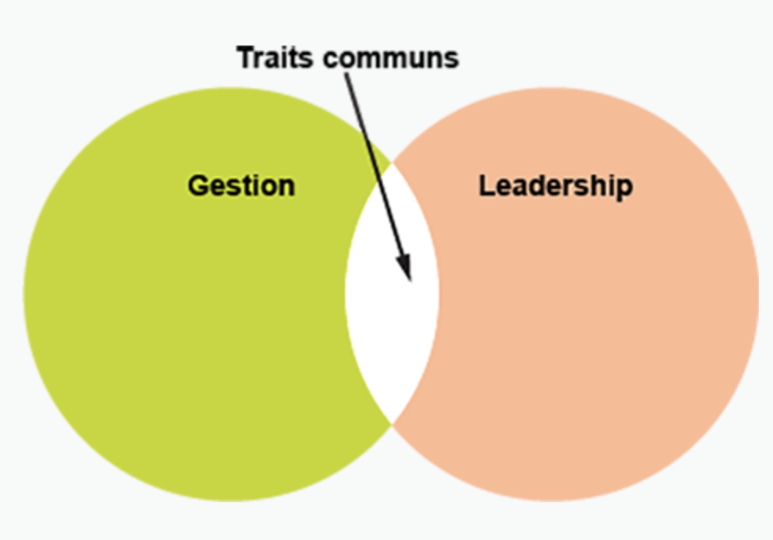
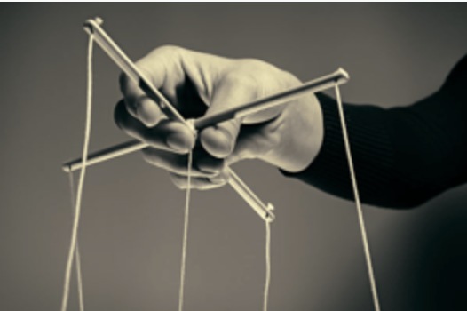
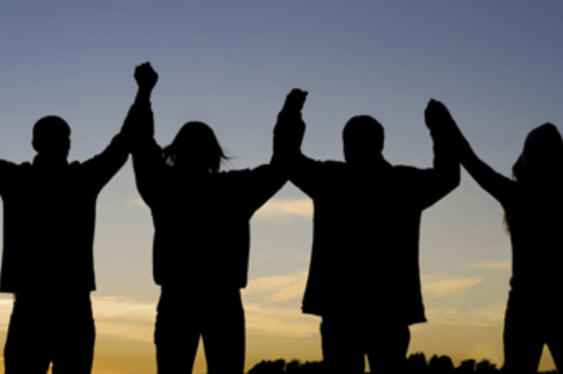
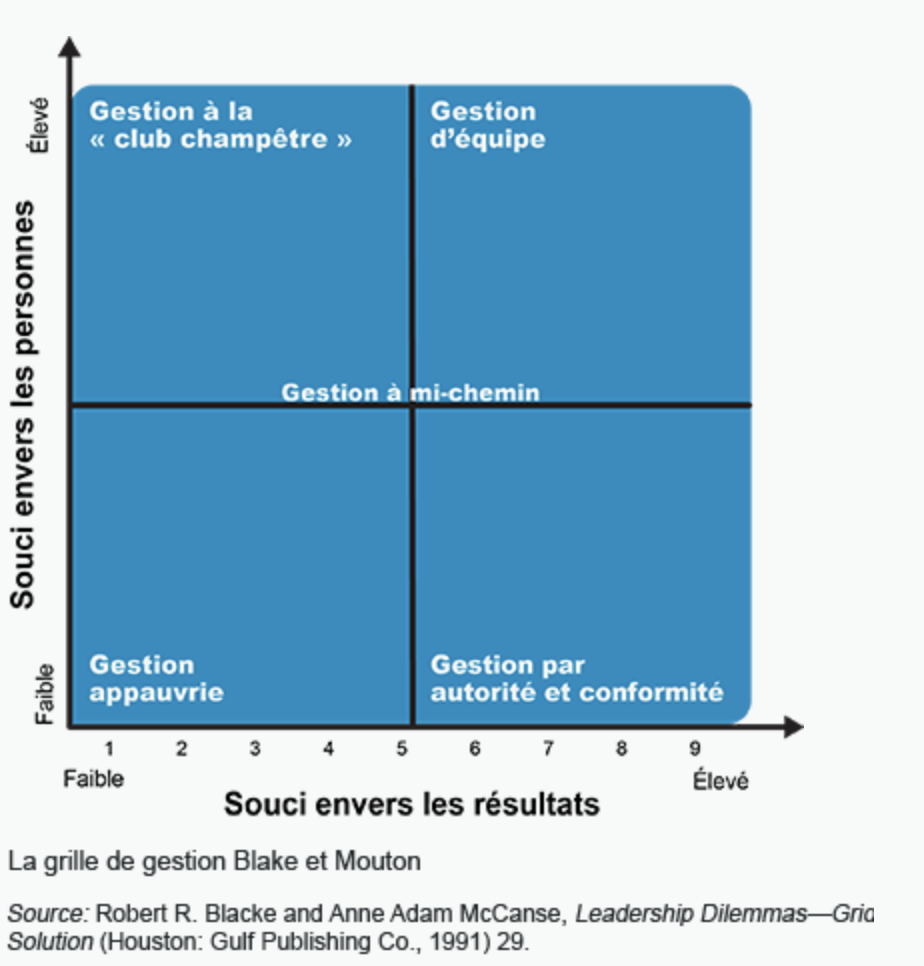

# Les traits et les caractéristiques du leadership

Le **leadership** peut être défini comme l’art d’influencer le comportement humain dans le but d’accomplir une mission ou d’atteindre un objectif. Le leadership ne consiste pas à faire faire un travail par les autres, mais à faire en sorte que les autres veulent faire ce travail.

**Digne de confiance**

La seule manière d’inspirer la confiance chez tes subordonnées est de les traiter avec équité et honnêteté. Les gens ne suivent pas un leader hypocrite.

**Inspirante ou inspirant**

Une bonne leader inspire la confiance en étant confiante. Ces leaders ont un esprit positif. Elles voient comme un défi ceux et celles qui disent « je ne peux pas » et convainquent les personnes qui les suivent qu’elles peuvent.

**Informée ou informé**

Les bons leaders doivent en savoir davantage que leurs subordonnés. Les autres posent des questions, les leaders y répondent.

**Visionnaire**

Les bonnes leaders voient des possibilités là où d’autres voient des difficultés ou un échec. Les leaders efficaces sont capables de communiquer leur vision aux autres et d’obtenir leur soutien. Elles choisissent toujours des projets qui correspondent à leurs valeurs personnelles.

**Curieuse ou curieux**

Les meilleurs leaders ne sont jamais satisfaits, parce qu’il y a toujours des choses à découvrir. Les bons leaders enthousiasment aussi les autres à trouver des réponses.

**Juste**

Une bonne leader traite tout le monde bien et inclut l’ensemble du personnel dans l’exploitation de l’entreprise. Chaque personne est considérée comme étant importante — et tout le monde se sent comme ça.

**Inclusif ou inclusive**

Les meilleurs leaders recherchent la diversité chez leur personnel. Ils croient à l’échange des idées et veulent la base la plus large possible comme tremplin pour générer de nouvelles initiatives.

**Brave**

Une bonne leader est prête à prendre des risques. Les meilleures leaders ne sont pas prudentes à l’excès, mais elles sont toujours calmes. Une bonne leader persévère malgré tout.

**Directe ou direct**

Un bon leader aborde les problèmes directement et n’évite pas les enjeux déplaisants, pas plus qu’il ne fait porter le blâme par d’autres.

**Imaginatif ou imaginative**

Un bon leader est créatif et trouve des solutions innovantes aux problèmes.

## Le leadership et la gestion

> La **gestion** peut être définie comme l’emploi efficace des ressources humaines et non humaines.

Le leadership est l’art d’influencer le comportement humain dans le but d’accomplir une mission ou d’atteindre un objectif. Contrairement aux gestionnaires, les leaders voient au-delà de ce que l’on attend d’elles et de leurs employés. Les leaders efficaces essaient non seulement de faire bien fonctionner le bureau, mais elles sont aussi à la recherche de moyens pour motiver leur personnel à faire mieux.

Le leadership est particulièrement nécessaire dans les organisations en démarrage et dans celles qui subissent des pressions pour changer.

Le leadership et la gestion sont deux fonctions distinctes, mais complémentaires. Même si les organisations tentes de promouvoir le leadership à touts les échelons, une gestion efficace demeurera toujours la clé de la réussite à long terme et de la stabilité. Le leadership efficace a besoin d’une fondation solide qui repose sur une gestion forte — qui planifie, organise et contrôle pour réaliser les objectifs du ou de la leader.

Article : [30 leaders issus des différentes communautés du Canada](https://thecanadianencyclopedia.ca/fr/article/30-leaders-issus-des-differentes-communautes-du-canada)

# Les approches du leadership

Imagine un instant que tu es gestionnaire d’une boutique d’équipement sportif a Kitchener, en Ontario. Récemment, tu as remarqué que ton personnel n’atteint pas les quotas de vente, ce qui nuit aux revenus. En tant que gestionnaire, c’est ton travail de veiller à ce que les objectifs fixés par le siège social soient atteints. Tu dois diriger ton personnel et trouver le moyen de l’inspirer pour qu’il augmente ses ventes. Comment procéderais-tu ? Est-ce que tu

a. lui inspirerais la peur en lui disant que si les ventes n’augmentent pas, il risque d’y avoir des licenciements ?

b. réunirais l’équipe pour discuter du problème et trouver des moyens d’augmenter les ventes ?

c. laisserais les choses aller et attendrais que ton personnel agisse de son propre chef ? Après tout, tu lui fais confiance pour prendre les meilleures décisions.

Ton choix de a, b ou c en dit long sur ton style de leadership. Dans cette leçon, on va découvrir les différents styles de leadership qu’une personne peut utiliser au travail et l’effet de ces styles sur l’atteinte des objectifs et la réalisation des stratégies. On explorera aussi différentes théories sur la manière dont les leaders gèrent certains problèmes.

## Les styles de leadership

Il existe plusieurs styles de leadership. Celui que l’on met en pratique dépends, en partie, de la personnalité du leader et, en partie, à la situation donnée. Une sergente d’armée qui dirige un peloton de soldats dans une zone de guerre ne vas probablement pas utiliser le même style de leadership d’un gestionnaire dans une entreprise de télécommunications.

Ces styles de leadership peuvent être classés comme suit:

- le leadership directif ou autocratique
- le leadership démocratique
- le leadership laissez-faire

### Le leadership directif ou autocratique

Ce style de leadership met beaucoup d’accent sur la tâche à accomplir. Les personnes reçoivent des ordres qui reposent sur l’information dont le ou la leader dispose au moment de la prise de décision.

Un leader autocratique donne peu de chance à la rétroaction. On pourra le retrouver dans des situations où les personnes qui le suivent ne sont normalement pas habilités à participer au processus décisionnel. Le leadership directif est aussi courant dans les milieux de travail dangereux, comme la police ou l’armée, où le processus décisionnel ne permet généralement pas la rétroaction.

### Le leadership démocratique

Comme son nom l’indique, dans un leadership démocratique, le personnel et les gestionnaires allient leurs forces pour prendre des décisions. La leader invite son personnel à participer au processus de prise de décisions.

Le leadership démocratique est souvent exercé dans les organisations composées de personnes issues de différents domaines d’expertise et où la personne qui prend les décisions a généralement besoin d’information détaillée et spécialisée de son personnel avant de prendre une décision éclairée. Chaque membre du groupe décisionnaire a son mot à dire et certains peuvent même se faire confier une recherche sur un sujet particulier pertinent à la discussion.

Imagine le scénario suivant :

> Une entreprise de boissons désire étendre sa part de marché dans le marché des boissons santé. Le chef du marketing, qui a un style de leadership démocratique, convoque un groupe d’employées et d’employés composé de membres des services de la recherche, des ventes et de la distribution, du marketing et des finances, pour discuter de la meilleure méthode pour accroitre les ventes de boissons santé. Une membre du service des ventes suggère comme marché cible les jeunes et, comme point de distribution, les écoles. Le leader demande à une analyste de vérifier l’aspect légal de la vente de boissons dans les écoles et de rédiger un rapport énumérant ce qui est permis et ce qui ne l’est pas. La réunion est suspendue jusqu’à ce que I’information soit rassemblée et que les membres puissent la consulter. Le groupe se réunira de nouveau et tout le monde aura la chance de donner son avis avant qu’une décision soit prise. Une fois la discussion terminée, quelqu’un suggérera un plan d’action et l’équipe votera pour l’accepter ou non.

Tu auras remarqué que le processus démocratique prend beaucoup de temps. Le leader dirige la discussion et contrôle la réunion, mais chaque membre peut faire valoir son point de vue. Par contre, lorsqu’une décision est prise, l’équipe est très motivée à agir pour que ça fonctionne.

### Le leadership laissez-faire

Ici, la leader fixe un objectif et laisse les employés et les employées trouver comment y arriver, en établissant leur propre routine à leur convenance. De cette façon, les employés assument davantage de responsabilités dans la détermination du meilleur moyen d’accomplir une tâche. En règle générale, la leader offre des conseils et de l’orientation seulement si on le lui demande. Cette forme de leadership fonctionne mieux dans les organisations composées de professionnelles et de professionnels très instruits, où l’écart de connaissances entre la personne qui dirige et les autres membres de l’organisation est étroit.

Revenons au scénario de l’entreprise de boissons. Le leader laissez-faire cré une équipe autonome dont l’objectif est d’élaborer un ou plusieurs plans pour augmenter la part de marché des boissons santé. L’équipe est composée des mêmes personnes que dans le scénario de la leader démocratique, mais elle se réunit la plupart du temps sans le leader. Le sentiment d’autonomie et de responsabilité qui en résulte motive les membres à donner le meilleur d’eux-mêmes et à mettre en œuvre les plans qu’ils élaborent. Pendant ce temps, le leader laissez-faire forme d’autres équipes pour résoudre d’autres problèmes et il fait le suivi, en plus d’encourager et d’habiliter chacune d’entre elles.

> Il faut souligner que toutes les situations peuvent exiger plus d’un style de leadership.

Par exemple, une leader pourrait devoir adopter un style autocratique pour gérer une crise, pour ensuite adopter un style plus démocratique par la suite, lorsqu’elle rencontre le personnel pour établir ce qui n’a pas bien été et comment éviter de telles situations à l’avenir.

## La grille de leadership de Blake-McCanse

De nombreux théoriciens de la gestion soutiennent que les leaders les plus efficaces sont ceux et celles qui sont capables de porter une attention particulière aux tâches et aux gens. La grille de leadership de Blake-McCanse évalue les lacunes des leaders lorsqu’il s’agit d’équilibrer leur aptitude à se concentrer sur les taches et leurs compétences relationnelles.

Cette approche repose sur I’hypothèse que la meilleure forme de leadership est la gestion d’équipe (voir le graphique qui suit), qui maximise le souci des personnes et de la production. Un ou une leader qui porte une attention particulière aux besoins des gens aux dépens des tâches se classe comme faisant de la gestion à la « club champêtre ».

Et le ou la leader qui dirige d’une matière qui maximise les réalisations des tâches et qui minimise les contributions des personnes tombe dans la catégorie de la gestion par autorité et conformité. Lorsque les leaders savent où ils se situent dans la grille du leadership, ils peuvent apporter les changements nécessaires à leur style de leadership pour se rapprocher de l’idéal de la gestion d’équipe.

## Exemples

**Gestion par autorité et conformité**

Une sergente d’armée montre à son peloton de soldats comment parader.

**Gestion à** “**club champêtre**”

Un groupe de hauts dirigeants se réunit au domaine de la présidente pour discuter de divers enjeux concernant l’entreprise dans un cadre décontracté.

**Gestion d’équipe**

Une équipe d’ingénieures et d’ingénieurs travaille tard pour parachever un nouveau produit.

**Gestion à mi-chemin**

Une équipe commerciale en pénurie de personnel est soumise à un stress considérable pour respecter un échéancier serré.

