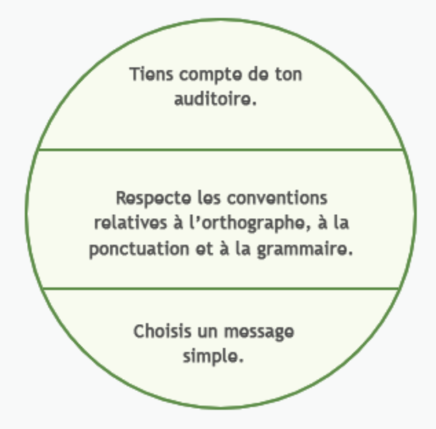

Quand dois-tu envoyer un message par courriel ? Quand dois-tu utiliser un format de lettre pus officiel ? En cas de problème au bureau, dois-tu en parler à la personne responsable en personne ou au téléphone ? Voici quelques lignes directrices dont il faut tenir compte avant de choisir le meilleur support pour un message particulier.

## L’importance du message

Quand la vitesse à laquelle est reçu un message est important, une conversation en personne ou au téléphone est important. Cependant, quand le contenu du message est important, il serait mieux de l’envoyer par écrit ou de façon enregistrée afin de pouvoir y faire référence dans le futur.

## Le degré de formalité requis

As-tu déjà remarqué à quel point ton style de conversation change au téléphone, selon la personne qui se trouve à l’autre bout du fil ? Par exemple, tu ne parles pas à ta meilleure amie de la même manière que tu parlerais à ta chef de service. C’est parce que la conversation avec ta chef est beaucoup plus formelle que l’appel de ton amie. La communication formelle vient avec beaucoup plus de règles que la communication informelle. La communication formelle doit se faire par écrit et peut exiger une réponse écrite formelle. En règle générale, les questions qui portent des conséquences juridiques doivent normalement être présentées par écrit et être signées.

Par exemple, une demande d’emploi ou une démission ne sera pas considérée comme étant officielle si elle n’a pas été faite par écrit.

## Le type et l’urgence de la rétroaction

Avant d’envoyer ton message, demande-toi à quel type de rétroaction tu t’attends et à quel moment tu l’attends. Si tu as besoin d’une réponse immédiate, tu devrais probablement envoyer un message verbal, au téléphone ou en personne. Au contraire, si tu transmets beaucoup de données, tu devrais probablement le faire au format électronique ou écrit.

# Scénarios

*Tu dois immédiatement envoyer un message de routine à plusieurs destinataires.*

Ici, un courriel serait un bon choix, car les récipiendaires peuvent le recevoir immédiatement. Une rencontre en personne ou un appel serait trop difficile à cause du grand nombre de destinataires. Une réunion pourrait fonctionner, si vous êtes déjà en réunion, si non, une réunion ne serait pas une utilisation efficace du temps.

*Tu considères que tu as reçu un mauvais service d’un électricien et tu veux raconter au président de l’entreprise ce qui s’est passé.*

Puisque tu veux une réponse immédiate au problème, un appel téléphone serait probablement la meilleure approche. Un courriel pourrait bien fonctionner aussi, surtout que le président est souvent occupé et n’est pas disponible pour des appels.

*Tu as entendu plusieurs rumeurs qui laissent croire que l’entreprise va être rachetée par une multinationale et que cela va occasionner des pertes d’emploi. Les rumeurs sont vraies, mais en partie seulement, et tu veux en informer ton personnel.*

Une réunion serait une façon efficace de transmettre l’information directement au personnel. Avec tout le monde dans la même salle, le personnel peut poser des questions afin de tenter de minimiser d’autres rumeurs ou spéculations.

*Un membre de ton personnel quitte l’entreprise et tu désires lui souhaiter bonne chance dans son nouvel emploi.*

Une rencontre en personne permettrait de souhaiter un désir sincère et empathique.

*Tu dois échanger de l’information avec un collègue en Inde à propos des spécifications techniques d’un projet sur lequel vous travaillez. Un appel téléphonique n’est pas justifié.*

Afin de s’assurer que l’information est bien transmise et peut être référé dans le futur, un courriel serait une bonne approche.

*Tu dois demander à des experts au sein de ton personnel si un contrat potentiel est réalisable.*

Parce que ceci nécessite probablement un aller et retour au niveau de la conversation, une réunion serait probablement la meilleure approche. Dans un mode de travail plus moderne, on pourrait aussi probablement le faire dans un message de groupe active, genre “chat room”.

*Un de tes gestionnaires de comptes en Indonésie a besoin d’une confirmation signée que la vice-présidente de l’exploitation est d’accord avec le contrat qu’il vient de négocier avec une cliente.*

Quand quelque chose nécessite une signature, ceci doit se faire de façon écrite, et donc sous la forme d’une lettre. Certains services en ligne et certains logiciels permettent de faire des signatures électroniques. Cependant, ceux-ci ne sont pas toujours acceptés. S’il y a possibilité que ce document pourrait service comme preuve apporté en cours, il est mieux d’avoir une vraie signature afin de minimiser les chances que la personne suggère que quelqu’un autre aurait utilisé sa signature électronique.

# Des conseils pour une communication

La communication efficace n’est jamais un accident. Les communicateurs et les communicatrices de qualité passent beaucoup de temps à créer le bon message. Un beau poème, un article de journal informatif, même une excellente présentation, ne sont pas dus à la chance : ils sont composés avec soin, avec les règles particulier au support.

*(Tient compte de ton auditoire. Respecte les conventions relatives à l’orthographe, à la ponctuation et à la grammaire. Choisi un message simple.)*

## Tiens compte de ton auditoire

Commence par te poser les questions suivantes :

- Est-ce que mon message tient compte de l’âge, du niveau de scolarité, des opinions et du statut social de mon public cible ?
- Est-ce que mon message tient compte des connaissances techniques de mon auditoire ou est-ce que je dois le simplifier ?
- Est-il possible que mon auditoire réagisse négativement à mon message et, le cas échéant, est-ce que j’ai suffisamment tenu compte de ses préoccupations ?

Ces questions t’aideront à éviter les obstacles à la communication efficace que nous avons étudiés plus tôt. En adaptant ton message à ton auditoire, tu minimiseras le nombre de distractions possibles. En faisant en sorte que ton message soit pertinent et facile à comprendre, tu attires l’attention de ton auditoire. Et en attirant l’attention de ton auditoire sur ton message, tu encourageras une rétroaction utile et tu créeras un environnement de communication ouverte.

La rétroaction est une partie essentielle de l’approche axée sur l’auditoire. Tu peux faciliter le processus de rétroaction en faisant preuve d’ouverture et de sympathie à l’égard des réactions de ton auditoire.

## Respecte les conventions relatives à l’orthographe, à la ponctuation et à la grammaire

Une mauvaise grammaire, une ponctuation erronée et des fautes d’orthographe peuvent gâcher un écrit. Premièrement, ce sont des distractions et elles font porter l’attention de la lectrice sur la mauvaise chose. Ensuite, elles présentent le rédacteur sous un mauvais angle. Ces types d’erreurs peuvent aussi entrainer une mauvaise communication. Lis l’énoncé suivant : « venez manger les enfants » Jouons le jeu. Si on pousse, ce message peut prendre plusieurs sens, selon l’endroit où on place la ponctuation. Est-ce que l’auteur voulait dire « Venez manger les enfants. » ou voulait-il dire « Venez manger, les enfants. » ? La ponctuation, et dans ce cas-ci les virgules, peut entrainer une grosse différence de sens !

Passe ton texte par un correcteur orthographique régulièrement, et possiblement par d’autres personnes. Rappelle-toi que le correcteur orthographique ne détectera pas les mots mal utilisés s’ils sont épelés correctement et a souvent de la difficulté avec la grammaire.

De plus, exerce une grande prudence quant à l’utilisation de l’argot dans tes communications en ligne ou ta messagerie texte personnelles. Utiliser « G » au lieu de « j’ai » ou « koi » au lieu de « quoi » donne une impression de mauvaise éducation et de paresse. ("Axe a question" au lieu de "Ask a question", etc.) Consigne quelques mots ou phrases que tu oublies souvent quand tu relis ton travail.

## Choisis un message simple

Veille à ce que ton message contienne l’essentiel. Donne les noms, les dates, les lieux, les heures et tous les détails pertinents, mais n’ajoute pas d’informations personnelles ni de récits familiers.

Lorsque tu rédiges une note de service ou un courriel, il n’est pas nécessaire d’utiliser des paragraphes ou une conclusion. Tu n’as qu’à donner les détails, en bref. Si tu communiques de I’information par téléphone, veille à avoir devant toi une liste de tous les détails importants et demande à la destinataire si elle a un papier et un crayon pour prendre des notes. Toi aussi, tu auras besoin d’un papier et d’un crayon pour noter la rétroaction.

# La communication non verbale

La communication comprend plus que le verbal. En fait le langage corporel forme 55 % du contenu d’un message et les mots ne forment que 7 % selon le chercheur Albert Mehrabian. Cependant, nous maîtrisons la communication verbale mieux que la non verbale.

Voici quelques éléments du langage non verbal :

### La gestuelle

Ce sont nos gestes expressifs qui accompagnent et complètent nos messages verbaux par exemple, le hochement de la tête pour signifier l’approbation ou des applaudissements pour montrer notre satisfaction ainsi que les bras croisés pour montrer notre fermeture.

### La posture

À titre d’exemple, se tenir droit et avoir une position ouverte ou en position assise s’adosser sur le dossier de la chaise pour montrer la volonté à interagir avec notre interlocuteur.

### Les expressions faciales

Il est difficile de cacher nos émotions, mais il faut faire attention dans certaines situations, car elles peuvent renforcer le message ou le modifier parfois sans qu’on le sache par exemple si vous souriez à quelqu’un, assurez-vous d’harmoniser le reste de vos messages non verbaux.

### La distance

On s’attend à ce que nos collègues respectent une certaine distance et n’envahissent pas notre espace personnel. Une bonne distance est d’environ 1 ou 2 mètres.

<iframe width="560" height="315" src="https://www.youtube.com/embed/pbOgHa34Ec8" title="YouTube video player" frameborder="0" allow="accelerometer; autoplay; clipboard-write; encrypted-media; gyroscope; picture-in-picture" allowfullscreen></iframe>

<iframe width="560" height="315" src="https://www.youtube.com/embed/bWyhsqh_e9s" title="YouTube video player" frameborder="0" allow="accelerometer; autoplay; clipboard-write; encrypted-media; gyroscope; picture-in-picture" allowfullscreen></iframe>

<iframe width="560" height="315" src="https://www.youtube.com/embed/XPlp8-d2v9E" title="YouTube video player" frameborder="0" allow="accelerometer; autoplay; clipboard-write; encrypted-media; gyroscope; picture-in-picture" allowfullscreen></iframe>